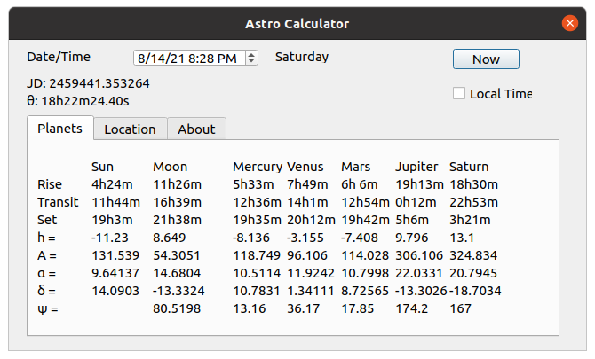

## Astrocalculator

Astrocalculator is a simple program to calculate astronomical ephemerides.



**Dependencies :**
- Qt 4.8.0 and above
- AA+ v2.33 and above (http://www.naughter.com/aa.html)

AA+ itself implements the algorithms from the book "Astronomical algortihms" by Jean Meeus. (http://www.willbell.com/math/mc1.htm)
You may find comments in the code refering to this book.

**Build:**
```
./getaaplus.bash
make distclean # to clean repo artifacts before pushing to github
qmake astrocalculator.pro
make -j4
make clean  # remove intermediate files but leaves app
```

**Supported platforms:**
- Every platform that Qt supports
